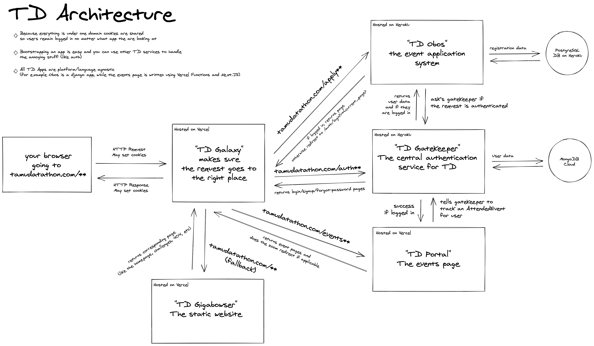

<h1 align="center">
  galaxy :milky_way:
</h1>

<p align="center">Request entrypoint for all TAMU datathon apps. Also manages builds for gatekeeper and obos.</p>

## Architecture 🧪
<p></p>

## Installation :computer:
1. Clone the repo: `$ git clone --recurse-submodules https://github.com/tamu-datathon-org/galaxy.git`
2. Install Docker https://docs.docker.com/get-docker/
3. Install Docker Compose https://docs.docker.com/compose/install/

## Usage :rocket:
```bash
$ docker-compose up
```

---

<p align="center">
  <a href="https://vercel.com?utm_source=tamu-datathon&utm_campaign=oss">
    TAMU Datathon is powered by </br>
  </a>
</p>